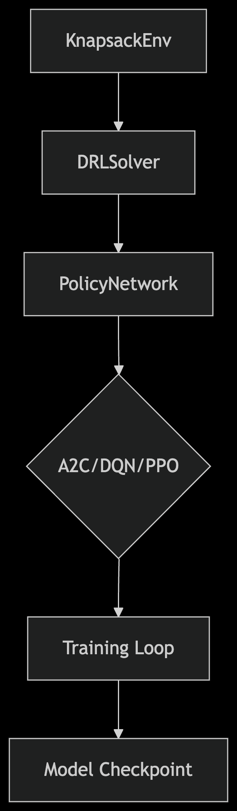
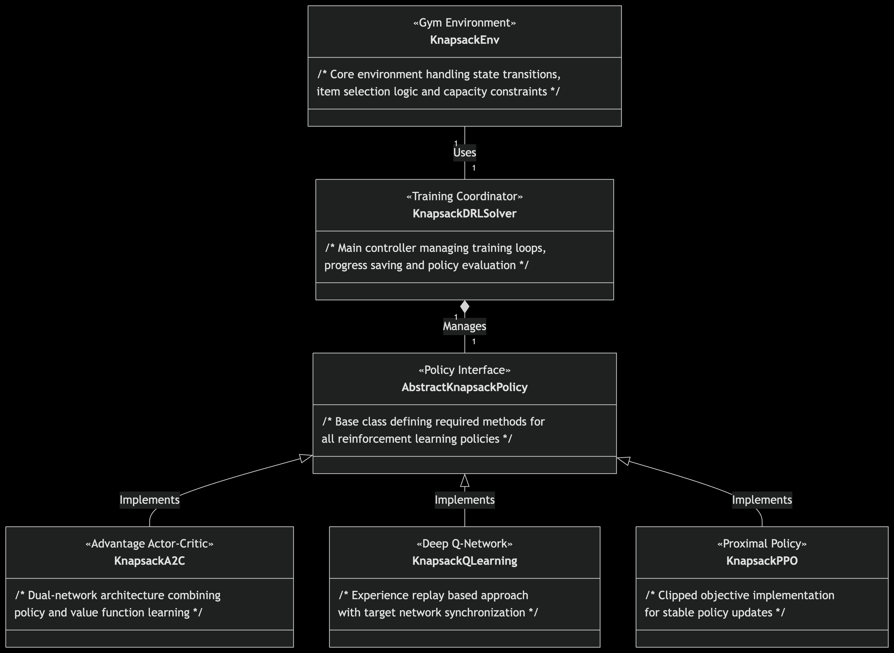

# COMP579 Final Project – Deep Reinforcement Learning for 0-1 Knapsack Optimization

This project applies Deep Reinforcement Learning (DRL) techniques to solve the classical **0-1 Knapsack Problem**, a well-known NP-hard combinatorial optimization task. We re-implemented and extended the research by **Afshar et al. (2019)**, who proposed a state aggregation method for improving DRL efficiency on the knapsack problem. Our objective was to reproduce, analyze, and enhance their methodology by integrating and comparing several RL architectures including **A2C**, **DQN**, and **PPO** within a custom OpenAI Gym environment.

---

## 📌 Project Highlights

- ✅ Custom Gym environment for simulating knapsack dynamics  
- ✅ Modular design using an abstract policy interface  
- ✅ Implementations of DRL algorithms: A2C, PPO, and DQN  
- ✅ Baseline solvers: Dynamic Programming and Greedy Heuristic  
- ✅ Support for state aggregation to reduce state dimensionality  
- ✅ Extensive experiment suite across diverse knapsack instance types  

---

## 📁 Project Structure

```
├── environment/
│   └── knapsackgym.py             # Custom Gym environment for 0-1 KP
│
├── models/
│   ├── AbstractKnapsackPolicy.py  # Base class for all policy implementations
│   ├── KnapsackA2C.py             # Advantage Actor-Critic
│   ├── KnapsackPPO.py             # Proximal Policy Optimization
│   ├── KnapsackQLearning.py       # Deep Q-Network (DQN)
│   ├── DP_Knapsack.py             # Dynamic Programming baseline
│   ├── Greedy_Knapsack.py         # Greedy heuristic baseline
│   └── StateAggregator.py         # Q-learning based state aggregation
│
├── solver/
│   ├── KnapsackDRLSolver.py       # Solver that coordinates training + evaluation
│
├── experiments/
│   └── experiment.ipynb           # Final experiments and result analysis
│
├── requirements.txt               # Python dependencies
└── README.md                      # This file
```

---

## 🔄 System Flow Overview

This diagram illustrates the overall flow of the training pipeline:



> Components:
> - `knapsackEnv(knapsackgym.py)` defines the environment.
> - `DRLSolver(KnapsackDRLSolver.py)` manages training and evaluation.
> - `A2C/DQN/PPO(AbstractKnapsackPolicy.py)` is extended by each RL agent (A2C, PPO, DQN).
> - Each model logs checkpoints and performance.

---

## 🧱 UML Class Diagram

The following UML diagram shows how the main components and classes interact:



> Arrows indicate class dependency and usage relationships.

---

## 🚀 How to Run the Code

### 1. Clone the Repository
```bash
git clone https://github.com/theodor-semerdzhiev/COMP579FINALPROJECT.git
cd COMP579FINALPROJECT
```

### 2. Create a Python Virtual Environment

#### Option A: VSCode
1. Open the project folder in VSCode.
2. Press `Ctrl + Shift + P` (or `Cmd + Shift + P` on macOS).
3. Choose "Python: Create Environment".

#### Option B: Manual Setup
```bash
python -m venv .venv
```

- **Windows**:  
  ```bash
  .venv\Scripts\activate
  ```

- **macOS/Linux**:  
  ```bash
  source .venv/bin/activate
  ```

### 3. Install Dependencies
```bash
pip install -r requirements.txt
```

### 4. Run Training or Experiments

You can explore experiments interactively:
- `solver/KnapsackDRLSolverTest.ipynb`
- `experiments/experiment_table1.ipynb`

Or run training directly:
```bash
python solver/KnapsackDRLSolver.py
```

---

## 📚 Reference

Afshar, R. R., Zhang, Y., Firat, M., & Kaymak, U. (2019).  
*A State Aggregation Approach for Solving Knapsack Problem with Deep Reinforcement Learning.*  
**Asian Conference on Machine Learning (ACML)**, PMLR Vol. 129, pp. 81–96.  
[Link](https://proceedings.mlr.press/v129/afshar20a.html)

---

## 👨‍💻 Authors

- **Theodor Semerdzhiev** – 261118892 – [theodor.semerdzhiev@mail.mcgill.ca](mailto:theodor.semerdzhiev@mail.mcgill.ca)  
- **Bohan Wang** – 261023725 – [bohan.wang@mail.mcgill.ca](mailto:bohan.wang@mail.mcgill.ca)  
- **Mikhail Lavrenov** – 261096558 – [mikhail.lavrenov@mail.mcgill.ca](mailto:mikhail.lavrenov@mail.mcgill.ca)
